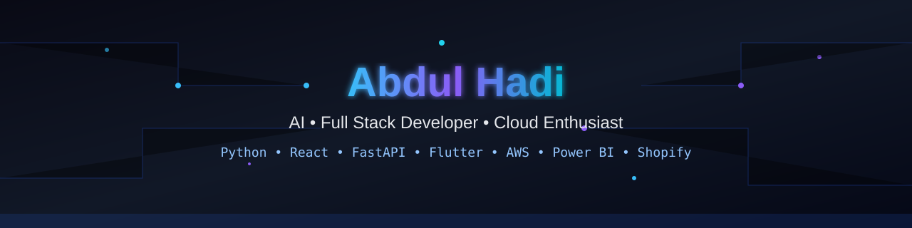

# Abdul Hadi

> AI Engineer • Machine Learning Enthusiast • Full Stack Developer • FAST-NUCES Lahore

---

# 👨‍💻 About Me

- 🎓 BS Computer Science Student at FAST-NUCES Lahore
- 🤖 Passionate about AI, ML, Deep Learning, NLP and Generative AI
- 🧠 Building LLM applications using LangChain, FastAPI and RAG
- 💻 Full Stack Developer (React, Node.js, Express, FastAPI)
- 📱 Flutter Developer
- ☁️ Learning AWS, Docker, LangGraph and Agentic AI

---

# 🤖 AI / ML Stack

**Languages**

Python • C++ • Java • JavaScript • SQL

**Frameworks**

TensorFlow • PyTorch • Scikit-Learn • OpenCV • Pandas • NumPy

**LLM Ecosystem**

LangChain • LangGraph • Hugging Face • Transformers • FAISS • ChromaDB • Pinecone • LlamaIndex • OpenAI API • Google Gemini • Ollama • MLflow

**Areas**

- Machine Learning
- Deep Learning
- NLP
- Computer Vision
- LLMs
- RAG
- AI Agents
- Prompt Engineering
- Data Engineering

---

# 🌐 Development

Frontend: React • Vite • HTML • CSS • Bootstrap

Backend: Node.js • Express • FastAPI • REST APIs • JWT

Mobile: Flutter

Databases: MySQL • PostgreSQL • SQLite • Firebase

Cloud: AWS • Docker • Linux • Git • GitHub

Tools: VS Code • Postman • Figma • Jupyter • Power BI • Shopify • n8n

---

# 🚀 Featured Projects

## Skillify Lab
AI-powered resume builder using NLP, FastAPI and LLMs.

## AI Resume Screener
ATS resume analyzer built with Python and Streamlit.

## AI Geospatial Planning
Park suitability analysis using GIS and Landsat imagery.

## Shopify Theme Development
Responsive Shopify themes using Liquid.

## Power BI Dashboard
Interactive KPI dashboards using DAX.

---

# 📈 GitHub Stats

---

# 📚 Currently Learning

- LangGraph
- Multi-Agent AI
- AWS Cloud
- Docker
- Kubernetes
- MLOps
- Data Engineering

---

# 📫 Connect

- GitHub: https://github.com/Hadi99999437
- LinkedIn: https://www.linkedin.com/in/abdul-hadi-b97b6a31b/

---

> **"Building intelligent software that solves real-world problems."**
